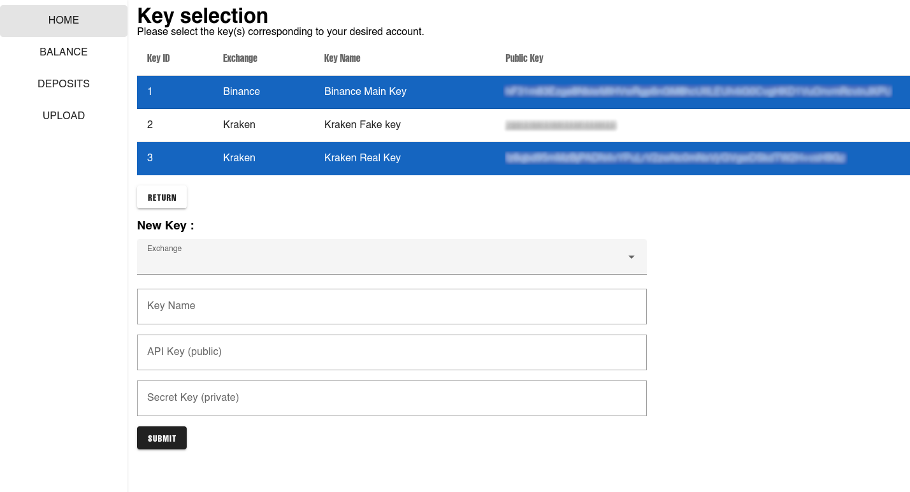
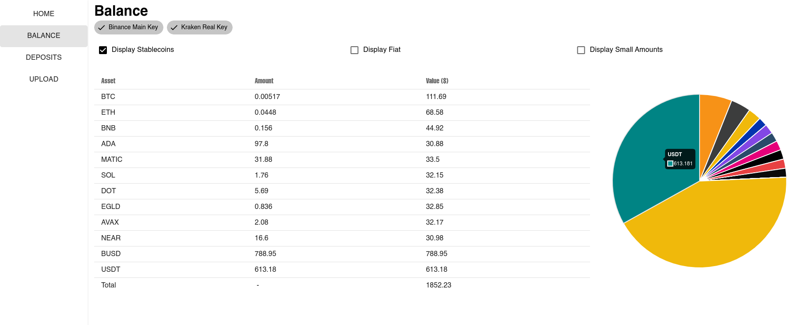
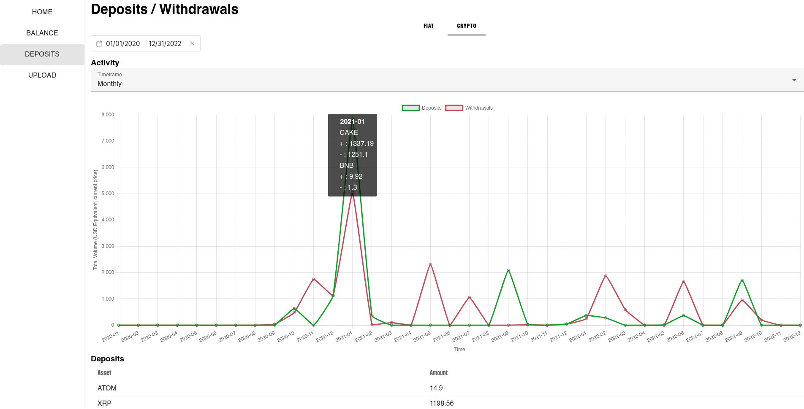

Track many crypto exchange accounts in a single App.

Currently compatible with Binance and Kraken.

## Home Page
#### Add your keys and select them to access the rest of the app

## Balance Page

#### Track your balance, group multiple accounts

## Deposits and Withdrawals page

#### Track your accounts' activity, FIAT and crypto deposits and withdrawals

## Upload

Binance and Kraken APIs do not expose deposits and withdrawals information.
To access this data, you need to upload your deposits and withdrawals statement, for each account, in the upload page.

## Security Notice

For safety reasons, please only use "Read-only" API keys. 
Both Binance and Kraken offer this option.

All your keys will be stored only in a local SQLite database.
